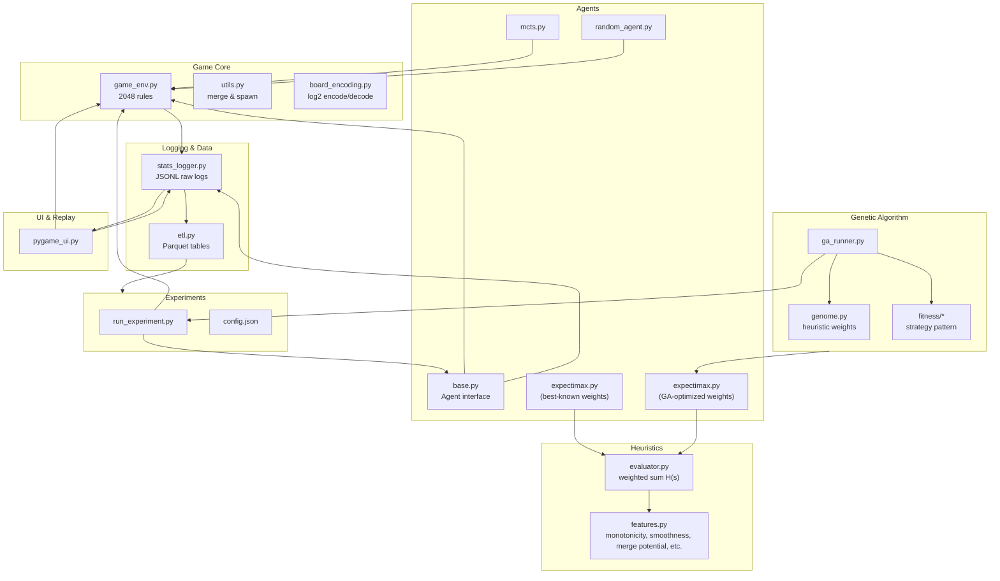
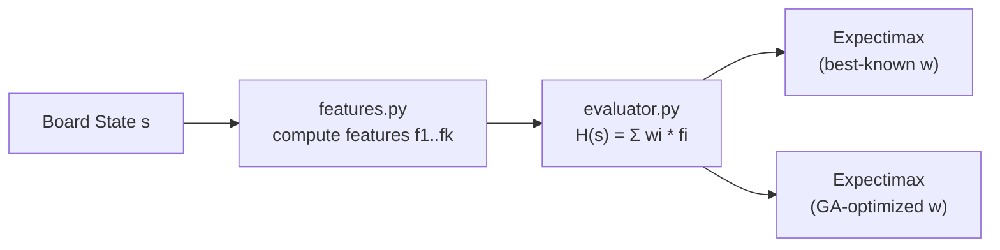
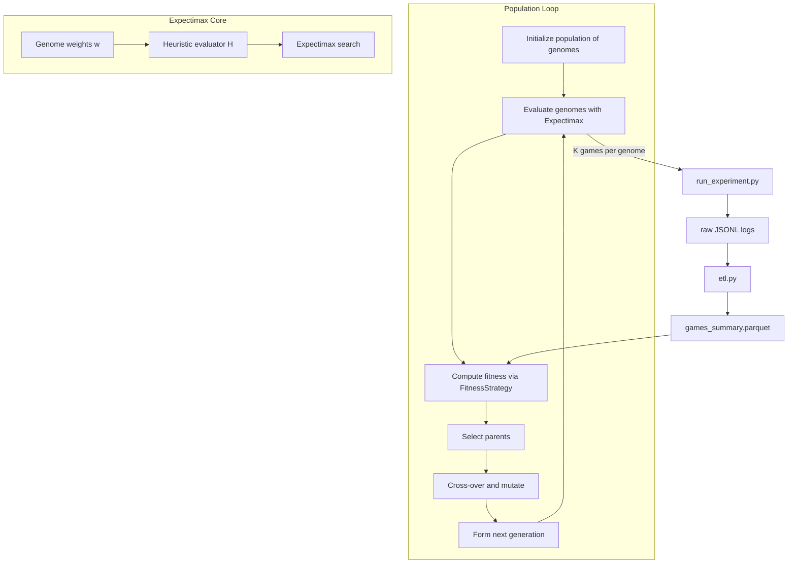

# 2048 AI Project Design Report

## 1. Overview

This document defines the complete architecture and design plan for a flexible 2048 AI research framework. The goals include:

* A fully configurable 2048 environment (n×n boards).
* Multiple agents: Expectimax, Monte‑Carlo Tree Search (MCTS), and human/pygame interaction.
* A robust logging and replay system with full per‑move state capture.
* An extensible experiment system with clean fitness‑strategy patterns for GA optimization.
* A scalable, analysis‑friendly data storage format (JSONL raw logs → Parquet tables).

The system prioritizes:

* Deterministic replays.
* Separation of logic, UI, and analysis.
* Ease of adding new agents and heuristics.
* Efficient large‑scale experiment execution.

---

## 2. File Structure

A recommended project layout:

```
2048-project/
  README.md
  requirements.txt
  setup.py (optional)

  src/
    game/
      game_env.py        # core rules and transitions
      utils.py           # tile merge, random spawn helpers
      pygame_ui.py       # rendering + human play + replay
      board_encoding.py  # log2 encoding/decoding helpers

    agents/
      base.py            # Agent interface
      expectimax.py
      mcts.py
      random_agent.py    # simple baseline

    heuristics/
      features.py        # monotonicity, smoothness, merge potential
      evaluator.py       # weighted heuristic evaluation

    ga/
      genome.py          # representation & mutation
      ga_runner.py       # population loop
      fitness/
        base.py          # strategy interface
        mean_score.py
        score_plus_bonus.py

    logging/
      stats_logger.py    # raw JSONL writer
      etl.py             # convert raw → parquet tables

    experiments/
      run_experiment.py  # executes N games for an agent
      config.json        # experiment-level settings

  data/
    raw_logs/            # JSONL files (one per experiment)
    processed/           # parquet tables (game summaries, steps, tile counts)

  notebooks/
    analysis.ipynb       # pandas/plots/statistics
```

---

## 3. File Responsibilities & Code Patterns

### 3.0 High-Level Architecture (Mermaid)



Below is the role of each major component and the design philosophy behind it.

### 3.1 `game_env.py`

**Responsibilities**:

* Pure game logic: board transitions, legal move detection, scoring, random tile spawn.
* Deterministic behavior under a provided RNG seed.
* No pygame dependencies.

**Patterns**:

* Functional-ish design:

  ```python
  next_state, reward, done, info = env.step(action)
  ```
* Encapsulate randomness with an injected RNG object.
* Expose a stable API for agents.

---

### 3.2 `pygame_ui.py`

**Responsibilities**:

* Human play mode.
* Replay mode using raw logs.
* Translate states into visuals.

**Patterns**:

* Thin wrapper around `game_env`.
* Does not influence experiment code.

---

### 3.3 Agents (`agents/*.py`)

Each agent implements:

```python
class Agent:
    def choose_action(self, state) -> action:
        ...
```

We conceptually separate **expectimax** into two configurations, sharing the same implementation but differing in how their heuristic weights are supplied:

1. **Expectimax (best-known weights)**

   * Uses a fixed, hand-picked or literature-derived set of heuristic weights.
   * Serves as the current "best-known" baseline.
   * Used for direct comparison against learned variants.

2. **Expectimax (GA-optimized weights)**

   * Uses weights produced by the GA pipeline.
   * During GA evaluation, each genome defines a weight vector, which is plugged into the shared expectimax implementation's evaluator.
   * The GA does *not* change search logic, only the heuristic evaluation function.

**Expectimax** (both variants):

* Uses iterative deepening.
* Uses weighted heuristics via `heuristics/evaluator.py`.
* Fully configurable depth/time limits.

**MCTS**:

* Simple UCT implementation.
* Rollouts using random or heuristic-guided policies.

**RandomAgent**:

* Baseline for evaluation.

---

### 3.4 Heuristics (`heuristics/`)

**Responsibilities**:

* Feature computation: monotonicity, smoothness, empty tiles, max tile, merge potential, etc.
* Evaluation model: `score = w1*f1 + w2*f2 + ...`.

**Patterns**:

* Stateless feature functions.
* Pluggable evaluators for GA weight optimization.



During GA training, each genome provides a different `w` vector. The **same** Expectimax search code is reused; only the underlying evaluator's weights change.

---

### 3.5 Genetic Algorithm (`ga/`)

**Genome Representation**:

* Vector of floats (one weight per heuristic).
* Supports mutation, crossover, normalization.

**GA Runner**:

* Runs a configurable number of generations.
* Each genome's fitness evaluated by running K games with **Expectimax(GA-weights)** and computing summary stats.

**Fitness Strategy Pattern**:

* Implemented via:

  ```python
  class FitnessStrategy:
      def compute(self, df):
          ...
  ```
* Examples include mean score, score + 2048 bonus, multi-objective combinations.



This diagram highlights that GA *wraps* the experiment + expectimax pipeline: for each genome, weights are injected into the shared evaluator, games are played, logs are processed, and a fitness score is computed from the resulting summary statistics.

---

### 3.6 Logging (`logging/stats_logger.py`)

**Responsibilities**:

* Per-game logging of all states, actions, heuristics, and summaries.
* Writes JSONL for append efficiency.

**Patterns**:

* Each game is one JSON object.
* Each step contains:

  * flattened log2 board encoding
  * action
  * reward, score
  * tile frequency table
  * heuristic dictionary
  * done flag
* Ensures deterministic replay by storing full states.

---

### 3.7 ETL (`logging/etl.py`)

**Responsibilities**:

* Convert raw JSONL logs into compact Parquet tables for analysis.
* Produce tables:

  1. `games_summary.parquet`
  2. `steps.parquet`
  3. `tile_counts.parquet`

**Patterns**:

* Long-format normalized tables suitable for groupby operations.
* Use pyarrow or pandas to write parquet.

---

## 4. Data Storage Structure

Data is stored in two stages:

---

### 4.1 Raw Logs (JSONL)

Each line represents one entire game:

```jsonc
{
  "game_id": "exp1_expectimax_042",
  "agent": "expectimax",
  "board_size": 4,
  "seed": 123,
  "config": {
    "depth_limit": 5,
    "time_limit_ms": 100,
    "heuristic_weights": {
      "empty": 2.7,
      "monotonicity": 1.0,
      "smoothness": 0.1,
      "merge_potential": 1.0
    }
  },
  "steps": [
    {
      "t": 0,
      "board": [0, 0, 0, 1, 0, 0, 0, 0, 0, 0, 0, 0, 0, 0, 0, 1],
      "action": null,
      "reward": 0,
      "score": 0,
      "tile_counts": {"2": 2},
      "heuristics": {
        "empty": 14,
        "monotonicity": 0.5,
        "smoothness": 0.0,
        "merge_potential": 0.0,
        "max_tile": 2
      },
      "done": false
    },
    {
      "t": 1,
      "board": [0, 0, 0, 0, 0, 0, 0, 0, 0, 0, 0, 0, 0, 0, 1, 1],
      "action": "UP",
      "reward": 4,
      "score": 4,
      "tile_counts": {"2": 1, "4": 1},
      "heuristics": {
        "empty": 14,
        "monotonicity": 0.6,
        "smoothness": 0.1,
        "merge_potential": 0.0,
        "max_tile": 4
      },
      "done": false
    },
    {
      "t": 2,
      "board": [0, 0, 0, 0, 0, 0, 0, 0, 0, 0, 0, 0, 0, 0, 0, 2],
      "action": "LEFT",
      "reward": 0,
      "score": 4,
      "tile_counts": {"4": 1, "8": 1},
      "heuristics": {
        "empty": 14,
        "monotonicity": 0.7,
        "smoothness": 0.2,
        "merge_potential": 0.0,
        "max_tile": 8
      },
      "done": false
    }
  ],
  "summary": {
    "final_score": 18560,
    "highest_tile": 2048,
    "game_length": 120,
    "final_tile_counts": {
      "2": 3,
      "4": 5,
      "8": 4,
      "16": 3,
      "32": 2,
      "64": 1,
      "128": 1,
      "256": 1,
      "512": 1,
      "1024": 1,
      "2048": 1
    },
    "final_heuristics": {
      "empty": 0,
      "monotonicity": 0.95,
      "smoothness": 0.8,
      "merge_potential": 0.0,
      "max_tile": 2048
    }
  }
}
```

**Strengths**:

* Perfect for deterministic replays.
* Human-readable & robust.
* Append-only writing.

---

### 4.2 Processed Parquet Tables

Created from raw logs via ETL.

#### Table 1: `games_summary.parquet`

One row per game:

* `game_id`
* `agent`
* `board_size`
* `seed`
* `final_score`
* `highest_tile`
* `game_length`
* Derived threshold flags (optional, can also be computed on the fly):

  * `reached_2048` = (`highest_tile` ≥ 2048)
  * `reached_4096` = (`highest_tile` ≥ 4096)
  * `reached_8192`, `reached_16384`, `reached_32768`, etc.
* Final heuristic values
* Metadata for clustering/analysis

**Design note:**

* From a storage and simplicity perspective, `highest_tile` alone is technically sufficient, and threshold booleans can be computed during analysis.
* If these thresholds are frequently queried (e.g., GA fitness that directly rewards reaching 2048 or 4096), it can be convenient to materialize them as explicit boolean columns for readability and minor speed gains.

Used for:

* 5-number summaries
* variance analysis across agents
* GA fitness evaluation

---

#### Table 2: `steps.parquet`

One row per step of every game:

* `game_id`
* `t`
* `action`
* `reward`
* `score`
* `done`
* Heuristic columns (`h_empty`, `h_monotonicity`, ...)
* Optionally: `board` (serialized list) for debugging

Used for:

* Performance-over-time curves
* Detecting “choking” midgame patterns
* Trajectory clustering

---

#### Table 3: `tile_counts.parquet`

A normalized long-format table:

* `game_id`
* `t`
* `tile_value`
* `count`

Used for:

* Tile distribution analysis over time
* Comparing stability/variance across agents
* Statistical modeling of tile emergence

---

## 5. Summary

This design emphasizes:

* Separation of concerns
* Deterministic and rich logging
* Flexible agents and experiments
* Scalable analysis via Parquet
* Extensibility for new heuristics, agents, or evaluation strategies

This architecture should comfortably support long-running experiments, GA optimization, cross-agent comparisons, and high-quality visualizations/replays without introducing tight coupling or data fragility.